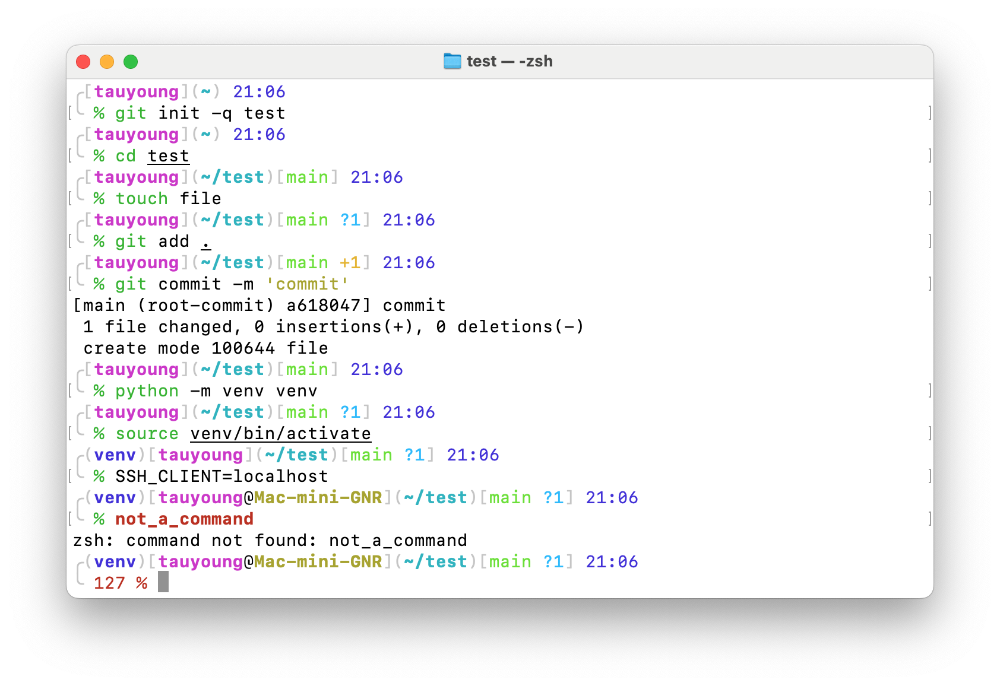
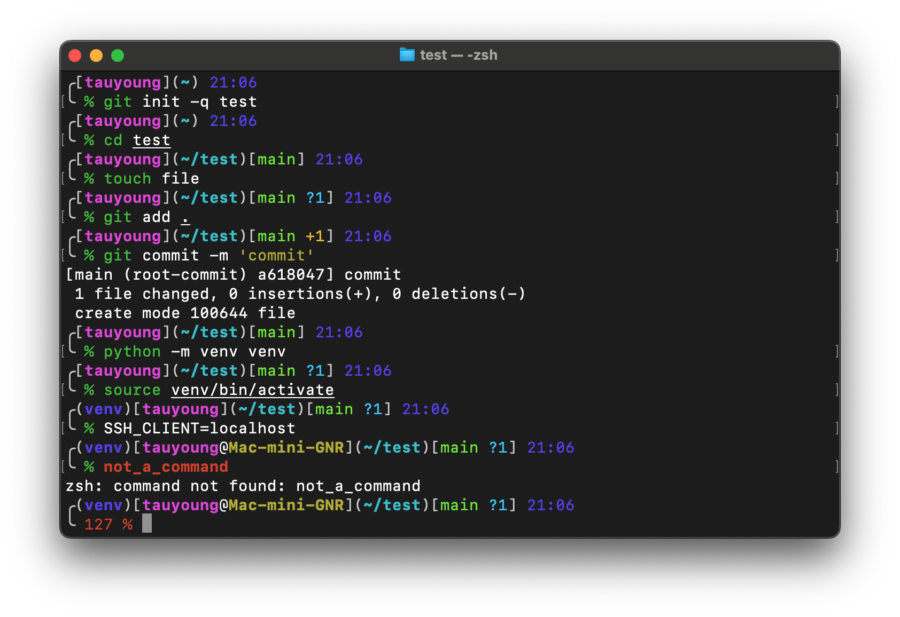

# A custom Zsh prompt style

This is a Zsh prompt style for my own use, inspired by [Oh My Zsh](https://github.com/ohmyzsh/ohmyzsh) built-in theme [fox](https://github.com/ohmyzsh/ohmyzsh/wiki/Themes#fox) and a popular Zsh theme [Powerlevel10k](https://github.com/romkatv/powerlevel10k).

To activate the prompt, source `prompt.zsh` in your `.zshrc`.

## Features




The prompt

- Is in a colorful style.
- Always shows the current user, working directory and time.
- Hides hostname when working locally.
- Shows git status when in a git repo.
- Shows virtualenv name when in a virtualenv.
- Shows the exit code when the last command returns an error.
- Truncates path when the prompt is too long.

## Dependencies

The prompt uses [gitstatus](https://github.com/romkatv/gitstatus) by [romkatv](https://github.com/romkatv) to acquire git status. You need to install it yourself.

With Homebrew:

```sh
brew install romkatv/gitstatus/gitstatus
source $(brew --prefix gitstatus)/gitstatus.prompt.zsh
```

Or manually:

```sh
git clone --depth=1 https://github.com/romkatv/gitstatus.git ~/gitstatus
source ~/gitstatus/gitstatus.prompt.zsh
```

Edit `prompt.zsh` to correctly source the plugin.
